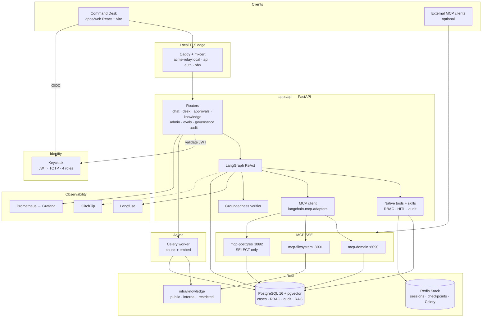
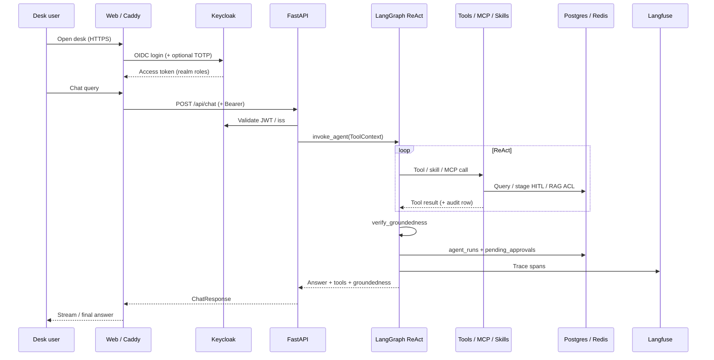
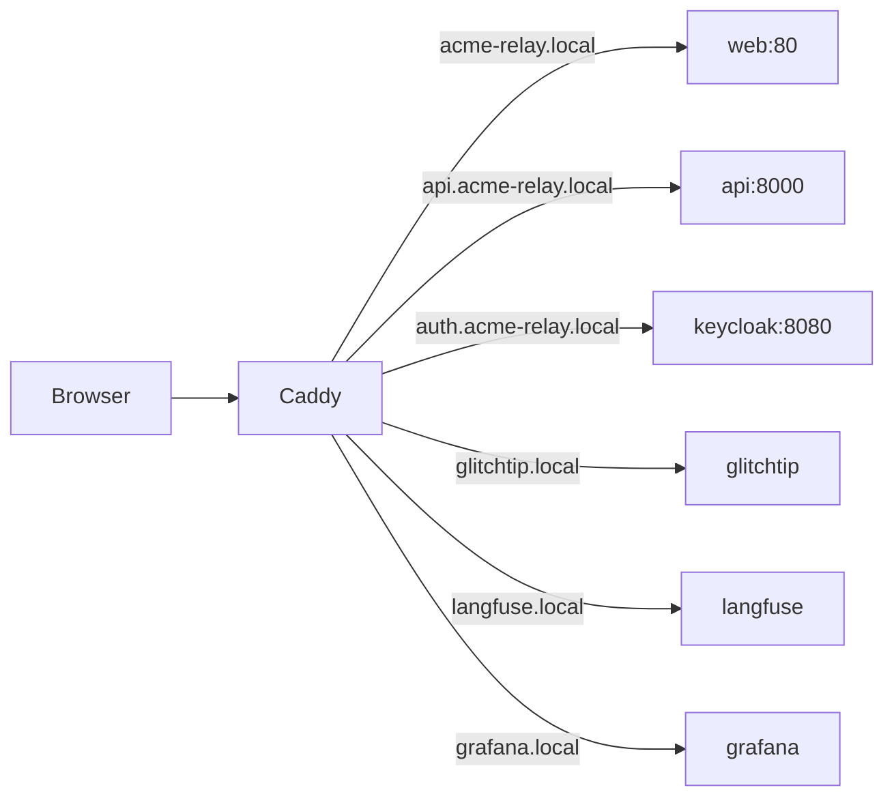

# Relay — Acme Operations Command Desk

**Relay** is an agentic enterprise assistant for the fictional client **Acme Operations**. Staff ask operational questions in natural language; a **LangGraph ReAct** agent selects tools dynamically against PostgreSQL, Redis session memory, **MCP servers**, and **RBAC-aware RAG** (pgvector), then applies a post-answer **groundedness** check before the reply reaches the desk.

This repository is an original product implementation (**Relay** / **Command Desk**). It shares architectural *patterns* with sibling Ops work, but uses a distinct UI, seed portfolio (**VaultLedger Payments**, **Aurora Bank**, **Nexus Freight**), and codebase — not a reskin.

| | |
|--|--|
| **Stack** | FastAPI · LangGraph · React/Vite · Keycloak · Postgres/pgvector · Redis · Celery · Caddy/mkcert |
| **Identity** | `sales_user` · `support_user` · `operations_user` · `admin` (+ TOTP MFA) |
| **Local entry** | `make demo` → **https://acme-relay.local** (TLS by default) |
| **Deliverables** | [`deliverables/`](deliverables/README.md) |

---

## Table of contents

1. [Quick start](#quick-start)
2. [Service URLs](#service-urls)
3. [Demo users & seed data](#demo-users--seed-data)
4. [Architecture overview](#architecture-overview)
5. [Request path (chat turn)](#request-path-chat-turn)
6. [Local HTTPS edge](#local-https-edge)
7. [RBAC, HITL & knowledge ACL](#rbac-hitl--knowledge-acl)
8. [MCP integration](#mcp-integration)
9. [Knowledge base](#knowledge-base)
10. [Observability](#observability)
11. [Evaluation](#evaluation)
12. [Quality & Kubernetes](#quality--kubernetes)
13. [Repository layout](#repository-layout)
14. [Further documentation](#further-documentation)

---

## Quick start

```bash
cd acme-relay
cp .env.example .env          # set OPENAI_API_KEY for LLM + embeddings
chmod +x infra/postgres/00-databases.sh
brew install mkcert nss       # once — local HTTPS trust store
make demo                     # certs + Caddy TLS + full Compose stack
make migrate-db               # RBAC / AM / knowledge catalog upgrades on existing volumes
```

**Prerequisites:** Docker Compose 24+, Make, mkcert (for TLS). Optional: Node 20+ / Python 3.11+ for local tests.

| Command | Purpose |
|---------|---------|
| `make demo` | Default path — HTTPS via Caddy + `*.local` |
| `make demo-http` | Escape hatch — `http://localhost:*` without Caddy |
| `make down` | Tear down the TLS stack |
| `make migrate-db` | Apply SQL upgrades (`03`…`08`) |
| `make eval-host` | Live eval suite against HTTPS API |
| `make quality` | Lint + pytest coverage ≥ 80% |

After first boot, as **dana** or **admin**: open **Knowledge → Run ingest** so pgvector chunks match the Markdown under `infra/knowledge/`.

---

## Service URLs

| Service | URL (`make demo`) | Notes |
|---------|-------------------|--------|
| **Command Desk** | https://acme-relay.local | React SPA; `/api` proxied to FastAPI |
| **API / OpenAPI** | https://api.acme-relay.local/docs | Bearer JWT from Keycloak |
| **MCP status** | https://api.acme-relay.local/api/mcp/status | Auth required |
| **Keycloak** | https://auth.acme-relay.local | Realm `acme` |
| **Langfuse** | https://langfuse.local | Agent + tool traces |
| **GlitchTip** | https://glitchtip.local | Exceptions |
| **Grafana** | https://grafana.local | `admin` / `admin` (change in prod) |

HTTP fallback (`make demo-http`): desk on http://localhost:5173, API http://localhost:8000, Keycloak http://localhost:8080.

Details: [docs/local-https.md](docs/local-https.md).

---

## Demo users & seed data

| User | Password | Role | Typical use |
|------|----------|------|-------------|
| `alice` | `alice123` | `sales_user` | Read customers/issues; public knowledge; **no** mutations / SQL MCP / ingest |
| `bob` | `bob123` | `support_user` | Cases + HITL next actions; search public/internal KB; **no** ingest |
| `dana` | `dana123` | `operations_user` | Mutations + audit + **knowledge ingest**; no admin/evals |
| `admin` | `admin123` | `admin` | Approvals, RBAC UI, evals, restricted KB, MFA admin |

Enable TOTP in Keycloak for MFA demos.

### Seed portfolio

| Account | ID | Tier | Contract | Renewal | Flagship case |
|---------|-----|------|----------|---------|---------------|
| VaultLedger Payments | `VAULTLEDGER` | Strategic | £680k | 2026-09-30 | **OPS-3101** settlement pending (critical) |
| Aurora Bank | `AURORABANK` | Standard | £185k | 2026-08-20 | **OPS-3102** webhook retries (high) |
| Nexus Freight | `NEXUSFREIGHT` | Enterprise | £420k | 2026-11-15 | **OPS-3103** POD delay NL-03 (medium) |

Desk features: Account 360 / risk scores, AM KPIs + charts, approvals inbox (seeded + agent-staged HITL), step-by-step Evaluations UI, AI Governance metrics.

---

## Architecture overview

High-level system (also in [`deliverables/03-architecture-diagram.mmd`](deliverables/03-architecture-diagram.mmd)):



### Component responsibilities

| Layer | Responsibility |
|-------|----------------|
| **Web** | Command Desk UX — Assistant, Dashboard, Customers, Issues, Tasks, Approvals, Knowledge, Audit, Governance, Admin, Trust/Help |
| **API** | JWT validation, permission gates, chat orchestration, desk/AM APIs, durable approvals, eval runner, governance metrics |
| **Agent** | Single `create_react_agent`; native tools + 4 skills + MCP tools; Redis checkpointer |
| **Groundedness** | Post-answer claim check vs tool corpus → `agent_runs` + `ChatResponse` |
| **Worker** | Knowledge ingest: chunk, embed, write `knowledge_chunks` with `allowed_roles` |
| **MCP** | Domain (customers/cases), Filesystem (KB files), Postgres (SELECT-only) |
| **Auth** | Keycloak realm roles; runtime matrix in `apps/api/auth/rbac.py`; catalog in Postgres `role_permissions` |
| **Obs** | Langfuse (LLM/tools), Postgres audit, GlitchTip, Grafana |

More detail: [docs/architecture.md](docs/architecture.md).

---

## Request path (chat turn)



Mutating tools (`create_next_action`, `update_issue`) **stage HITL** — they appear on **Approvals** (durable Postgres) until an admin decides. Seeded pending next actions (e.g. VaultLedger bridge) appear in the same inbox.

---

## Local HTTPS edge



- Overlay: [`docker-compose.tls.yml`](docker-compose.tls.yml) + [`infra/caddy/Caddyfile`](infra/caddy/Caddyfile)
- Certs: `make tls-certs` → `infra/caddy/.certs/` (gitignored), via mkcert
- JWT `iss` must be `https://auth.acme-relay.local` when using `make demo`

---

## RBAC, HITL & knowledge ACL

### Runtime permission highlights

| Permission | sales | support | operations | admin |
|------------|:-----:|:-------:|:----------:|:-----:|
| `read_customer` / `read_issues` / `search_knowledge` | ✓ | ✓ | ✓ | ✓ |
| `create_next_action` / `update_issue` / `mcp_sql` | | ✓ | ✓ | ✓ |
| `ingest_knowledge` | | | ✓ | ✓ |
| `view_audit` | | | ✓ | ✓ |
| `approve_next_action` / `run_evals` / `manage_users` | | | | ✓ |

**Enterprise boundary:** support may **search** knowledge; only **operations + admin** may **ingest** (rebuild RAG corpus).

Knowledge retrieval also applies **document ACL** (`allowed_roles` on chunks) *before* vector ranking — sales never receives restricted executive protocol content even though they can call `search_knowledge`.

Admin → **RBAC control** edits Postgres `role_permissions` (catalog). Live tool allow/deny currently follows `apps/api/auth/rbac.py` — keep them aligned when changing policy.

---

## MCP integration

| Server | Port | Example tools | Permission |
|--------|------|---------------|------------|
| Domain | 8090 | `domain_relay_get_customer_by_name`, list open issues | `mcp_read` |
| Filesystem | 8091 | `filesystem_fs_read_file`, list directory | `mcp_read` |
| Postgres | 8092 | `postgres_postgres_query` (SELECT only) | `mcp_sql` |

Agent loads MCP tools when `ENABLE_MCP_AGENT_TOOLS=true` (default). Status: `GET /api/mcp/status`. Startup calls `warm_mcp_tools()` (non-fatal on failure).

---

## Knowledge base

Corpus under [`infra/knowledge/`](infra/knowledge/) (mounted at `/data/knowledge`):

| Tier | Examples | Who retrieves |
|------|----------|---------------|
| **Public** | Command Desk business value; SLA / commercial guide | All staff |
| **Internal** | Escalation; VaultLedger / Aurora / Nexus runbooks; HITL guide | support, operations, admin |
| **Restricted** | Executive incident protocol; commercial renewal war-room | **admin only** |

```bash
make migrate-db                                    # catalog rows (07 + ingest ACL 08)
# dana or admin → Knowledge → Run ingest
```

---

## Observability

| System | Role |
|--------|------|
| **Langfuse** | LLM generations, tool spans, prompt name/version, session/user, I/O |
| **Postgres** | `tool_call_audit` (`source` native/mcp), `agent_runs` (groundedness), HITL `pending_approvals` |
| **GlitchTip** | Exceptions |
| **Grafana / Prometheus** | API metrics |

Audit UI expands rows with deep links when observability URLs are configured.

---

## Evaluation

10-question live suite (`evals/eval_questions.json`) covering tool selection, groundedness, RBAC (incl. restricted KB), and HITL next actions.

```bash
make demo
make eval-host
# or UI: admin → Evaluations → Run suite (Step 1…N progress)
```

Results → [`evals/eval_results.md`](evals/eval_results.md). Commentary → [`deliverables/04-eval-results.md`](deliverables/04-eval-results.md).

---

## Quality & Kubernetes

```bash
make quality           # ruff + pytest coverage ≥ 80%
make kustomize-build   # Ingress + NetworkPolicy + MCP Deployments
make argocd-apply      # after setting repoURL in Argo Application
```

GitOps notes: [docs/argocd.md](docs/argocd.md), [infra/kubernetes/README.md](infra/kubernetes/README.md).

### Brief coverage

| Requirement | Relay |
|-------------|-------|
| Dynamic LLM tool use | LangGraph ReAct |
| Profile / issues / summarise / next action | Native tools |
| MCP in the agent | Domain + Postgres + Filesystem |
| Groundedness | Post-answer verifier + `agent_runs` |
| Skills | Escalation, SLA, triage, handoff |
| Keycloak + RBAC | 4 roles + DB catalog; ingest = ops/admin |
| Compose + local TLS | `make demo` (Caddy/mkcert) |
| K8s | Ingress, NetworkPolicy, MCP, Argo CD |
| Eval + observability | `evals/` + Langfuse / GlitchTip / Grafana |

---

## Repository layout

```text
acme-relay/
├── apps/
│   ├── api/           # FastAPI, LangGraph agent, RBAC, routers
│   ├── web/           # Command Desk (React)
│   ├── worker/        # Celery knowledge ingest
│   ├── mcp-domain/
│   ├── mcp-filesystem/
│   └── mcp-postgres/
├── infra/
│   ├── caddy/         # TLS Caddyfile (+ .certs/ gitignored)
│   ├── knowledge/     # RAG Markdown (public / internal / restricted)
│   ├── keycloak/      # Realm export
│   ├── postgres/      # init, seed, migrations 03–08
│   └── kubernetes/    # Deployments, Ingress, NetPol, Argo
├── evals/             # Questions + live runner
├── deliverables/      # Submission pack
├── docs/              # Architecture, threat model, HTTPS, runbooks
├── docker-compose.yml
├── docker-compose.tls.yml
└── Makefile
```

---

## Further documentation

| Doc | Topic |
|-----|--------|
| [docs/architecture.md](docs/architecture.md) | Components, MCP, scaling |
| [docs/database-schema.md](docs/database-schema.md) | Schema |
| [docs/threat-model.md](docs/threat-model.md) | Threats & mitigations |
| [docs/tradeoffs.md](docs/tradeoffs.md) | Design trade-offs |
| [docs/local-https.md](docs/local-https.md) | mkcert / Caddy |
| [docs/skills.md](docs/skills.md) | Agent skills |
| [docs/CONTRIBUTING.md](docs/CONTRIBUTING.md) | Dev workflow |
| [deliverables/README.md](deliverables/README.md) | Assessment artifacts 1–7 |
| [deliverables/03-architecture-diagram.mmd](deliverables/03-architecture-diagram.mmd) | Canonical Mermaid source |

```bash
make deliverables-zip   # → deliverables/relay-command-desk-source.zip
```

### AI usage notes

See [docs/ai-usage-notes.md](docs/ai-usage-notes.md) and [deliverables/05-ai-usage-notes.md](deliverables/05-ai-usage-notes.md).
