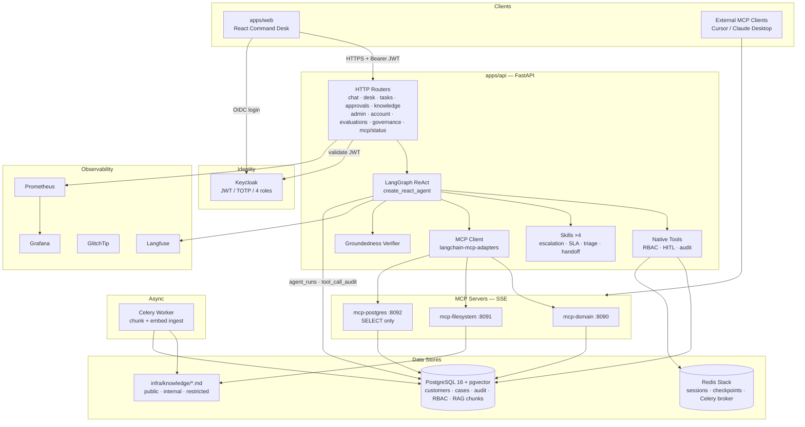

# Deliverable 3 — Architecture Diagram

## System-level diagram

Open [`03-architecture-diagram.mmd`](./03-architecture-diagram.mmd) in any Mermaid-compatible viewer (GitHub, VS Code Mermaid extension, https://mermaid.live).



Also see the compact in-repo diagram: [`../docs/architecture-diagram.mmd`](../docs/architecture-diagram.mmd).

---

## Data flow summary

### 1. Authentication

```text
User → Keycloak (OIDC + optional TOTP) → JWT
  → Web stores token → API validates issuer + realm roles
  → sales_user | support_user | operations_user | admin
```

### 2. Chat / agent

```text
POST /api/chat
  → RBAC ToolContext
  → LangGraph ReAct (native + skills + MCP)
  → tool_call_audit (source native|mcp)
  → verify_groundedness
  → persist agent_runs
  → ChatResponse + groundedness payload
```

### 3. Dashboard

```text
GET /api/desk/summary
  → open/critical cases, pending actions, SLA risk, tasks, groundedness rate
  → role_scope returned for UI
```

### 4. RAG knowledge

```text
Markdown under infra/knowledge/{public,internal,restricted}/
  → POST /api/knowledge/ingest → Celery
  → chunk + embed → knowledge_chunks (pgvector + allowed_roles)
  → search_knowledge: roles filter THEN vector distance
```

### 5. Observability

```text
Chat request
  → Langfuse CallbackHandler + tool spans
  → Prometheus /metrics
  → GlitchTip on exceptions
  → Postgres agent_runs / tool_call_audit mirror
```

### 6. GitOps

```text
Git → Argo CD Application → kustomize base
  (api, worker, web, MCP, Ingress, NetworkPolicies)
```

---

## Security boundaries

| Boundary | Control |
|----------|---------|
| Browser → API | Keycloak JWT, CORS; Ingress TLS in K8s |
| API → tools | `PERMISSIONS` + MCP prefix map + HITL |
| MCP postgres | SELECT-only keyword blocklist; support/ops/admin only |
| RAG | `allowed_roles && user_roles` before ranking |
| Cluster | Default-deny NetworkPolicy; API→MCP allowlist |
| LLM keys | Server-side only |

See [`../docs/threat-model.md`](../docs/threat-model.md).
