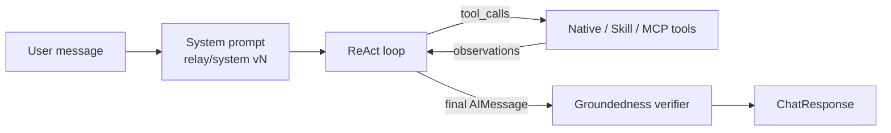

# Deliverable 7 — Agentic AI System & LangGraph Implementation

How the Relay agent is built: orchestration, graph topology, tools, MCP, groundedness, and observability.

---

## 1. System overview

Relay uses a **single LangGraph ReAct agent** that dynamically selects tools. MCP tools are merged into the same tool list. Every answer is verified for groundedness against the tool-call corpus.

```text
POST /api/chat
    │
    ▼
routers/chat.py
    │
    ├── Build ToolContext (sub, roles, request_id, tool_calls_log)
    ├── append_message(session, user)
    │
    ▼
agent/graph.py :: invoke_agent()
    │
    ├── prompt_service.compile_system(user_roles=…)
    ├── build_react_agent(ctx)
    │     ├── await build_langchain_tools(ctx)   ← native + skills + MCP
    │     ├── ChatOpenAI
    │     └── AsyncRedisSaver checkpointer
    ├── create_react_agent(...).ainvoke(messages)
    │
    ▼
verify_groundedness(answer, tool_calls_log)
    │
    ├── persist agent_runs (+ groundedness_*)
    ├── finalize Langfuse run
    └── ChatResponse { answer, tools_used, pending_approvals, groundedness }
```

**Key design choice:** Single ReAct (not multi-agent supervisor) keeps tool selection visible for evals and matches the brief. MCP and skills extend capability without a second routing graph.

---

## 2. Entry points and configuration

| Component | File | Role |
|-----------|------|------|
| HTTP router | `apps/api/routers/chat.py` | `POST /api/chat` |
| Graph | `apps/api/agent/graph.py` | `create_react_agent` + invoke |
| Tool wrappers | `apps/api/agent/tool_router.py` | Native `StructuredTool` + MCP merge |
| Native executors | `apps/api/agent/tools.py` | SQL tools + `ToolContext.run_mcp` |
| MCP client | `apps/api/agent/mcp_client.py` | SSE MultiServerMCPClient |
| Groundedness | `apps/api/agent/groundedness.py` | Post-answer verifier |
| Skills | `apps/api/skills/` | Escalation, SLA, triage, handoff |
| Prompts | `apps/api/prompts/relay-system.yaml` | Versioned system prompt |
| Checkpoints | `apps/api/memory/checkpoint.py` | Redis `AsyncRedisSaver` |

### Environment flags

| Variable | Effect |
|----------|--------|
| `ENABLE_MCP_AGENT_TOOLS` | Load MCP tools into ReAct list |
| `MCP_*_URL` | SSE base URLs for domain/filesystem/postgres |
| `OPENAI_API_KEY` / `OPENAI_MODEL` | Chat model |
| `EMBEDDING_MODEL` | Knowledge embeddings |
| `ENABLE_LANGFUSE` | LangChain callbacks + tool spans |

---

## 3. Graph topology



Implementation uses LangGraph prebuilt:

```python
# agent/graph.py (conceptual)
tools = await build_langchain_tools(ctx)
agent = create_react_agent(llm, tools, checkpointer=checkpointer)
result = await agent.ainvoke({"messages": [SystemMessage(...), HumanMessage(...)]}, config)
```

Thread memory: Redis checkpoint keyed by `session_id` / `thread_id`.

---

## 4. Tools

### Native tools

| Tool | Permission | Notes |
|------|------------|-------|
| `get_customer_profile_by_name` | `read_customer` | All staff |
| `get_open_issues` | `read_issues` | All staff |
| `summarize_issue_history` | `summarize_issues` | Hides `is_internal` from sales-only |
| `search_knowledge` | `search_knowledge` | ACL RAG |
| `create_next_action` | `create_next_action` | HITL — support/ops/admin |
| `update_issue` | `update_issue` | HITL — support/ops/admin |

### Skills (4)

| Tool name | Purpose |
|-----------|---------|
| `run_escalation_summary_skill` | Escalation brief |
| `run_sla_breach_assessment_skill` | SLA risk |
| `run_issue_triage_skill` | Prioritised triage |
| `run_shift_handoff_skill` | Shift handoff |

### MCP tools (wired)

Loaded via `langchain-mcp-adapters` with `tool_name_prefix=True`:

| Server key | Example tools | RBAC |
|------------|---------------|------|
| `domain` | `domain_relay_*` | `mcp_read` |
| `filesystem` | `filesystem_fs_*` | `mcp_read` |
| `postgres` | `postgres_postgres_query` | `mcp_sql` (not sales) |

Startup: `warm_mcp_tools()` in FastAPI lifespan. Status: `GET /api/mcp/status`.

```python
# tool_router.py (conceptual)
tools = [...native..., ...skills...]
if is_mcp_enabled():
    mcp_base = await get_mcp_base_tools()
    tools.extend(wrap_mcp_tools_for_context(mcp_base, ctx))
```

---

## 5. RBAC & HITL

```text
JWT realm roles → Role enum → has_permission / tool_allowed
  ├── Unknown native tool → admin only
  ├── MCP prefix → mcp_read / mcp_sql
  └── Mutating tools → requires_hitl → pending_approvals list
```

HITL flow:

1. Agent calls `create_next_action` / `update_issue`.
2. Tool returns `pending_approval` and appends to `ctx.pending_approvals`.
3. UI / `POST /api/approvals/stage` + `decide` (admin) commits to `next_actions`.

Roles: `sales_user`, `support_user`, `operations_user`, `admin`.

---

## 6. Groundedness

```python
verification = verify_groundedness(answer, tool_calls_log)
# Safe phrases (permission denied, approval, greetings) → pass
# Factual CASE-* / MERIDIAN|CASCADE|NORTHLINE without tools → fail
# Case/account tokens must appear in tool corpus → else fail
```

Returned on `ChatResponse.groundedness` and stored on `agent_runs`.

---

## 7. Prompts

Source of truth: `apps/api/prompts/relay-system.yaml`

- Versioned (`version: N`) with `production` label
- Variable `{user_roles}` injected at compile time
- CI gate: `scripts/check_prompts.py`
- Governance UI shows active version (`GET /api/governance/prompts`)

---

## 8. Observability

| Layer | What |
|-------|------|
| Langfuse | Callbacks on graph + explicit tool spans + finalize run |
| Postgres | `tool_call_audit`, `agent_runs` |
| GlitchTip | Exceptions when DSN set |
| Prometheus | `/metrics` |

Correlate with `request_id` (also Langfuse trace id).

---

## 9. Comparison to multi-agent designs

| Aspect | Relay | Typical multi-agent (e.g. Ops) |
|--------|-------|-------------------------------|
| Graph | Single ReAct | Supervisor + research/action/skill |
| Eval clarity | High — one tool list | Routing can obscure selection |
| Latency | Fewer hops for simple queries | Extra classify + specialist hops |
| MCP | Merged into same list | Often research-scoped |

Relay deliberately stays single-loop; skills cover structured workflows without a second agent process.

---

## 10. File map

```
apps/api/agent/
  graph.py           # build + invoke ReAct
  tool_router.py     # LangChain tools + MCP merge
  tools.py           # executors + ToolContext.run_mcp
  mcp_client.py      # SSE client, warm, wrap, serialize
  groundedness.py    # verify + policy
apps/api/skills/     # four reusable skills
apps/api/prompts/    # versioned YAML
apps/api/memory/     # Redis checkpoint + session
apps/api/telemetry/  # Langfuse
```
